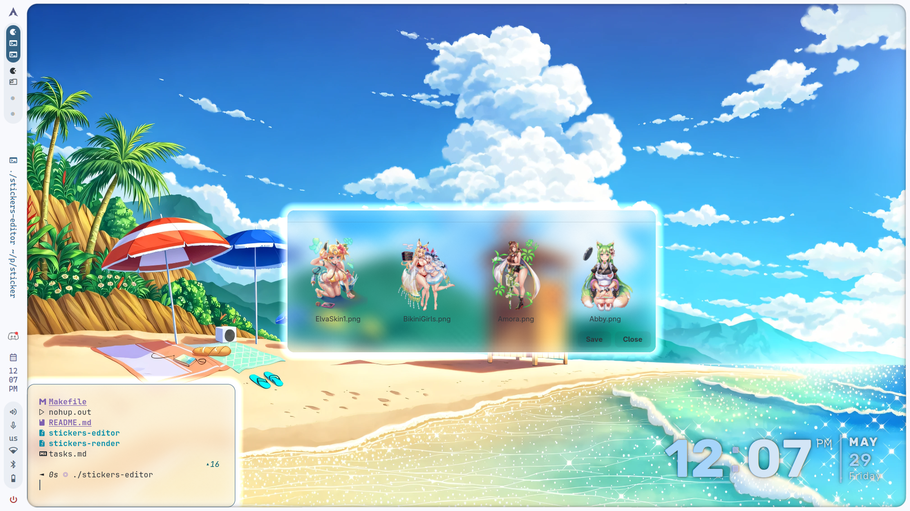

# 🎨 WaySticker - Desktop Overlay Sticker System

<div align="center">


A **modern**, **lightweight**, **native** dual-application Linux desktop sticker system built with GTK4 and Wayland layer-shell protocol.

[](LICENSE)
[](https://wayland.freedesktop.org/)
[](#)
[](https://en.wikipedia.org/wiki/C_(programming_language))

[Quick Start](#quick-start) • [Installation](#installation) • [Usage](#usage) • [Architecture](#architecture) • [Contributing](#contributing)

</div>

---

## Screenshots

| Editor Interface | Desktop Overlay |
|---|---|
|  |  |

---

## Why WaySticker?

- **Pure Wayland Native**: Built with GTK4 + gtk4-layer-shell (no X11 fallback, no compromises)
- **Lightweight**: ~40KB editor + ~25KB renderer (no Electron, no scripting)
- **Performance**: Minimal CPU/memory footprint with zero startup time
- **Modern Stack**: C + GTK4 + JSON for clean, maintainable code
- **Compositor Friendly**: Works seamlessly with Hyprland, Sway, and other modern Wayland compositors
- **Persistent**: Save/load sticker positions and sizes as JSON config
- **Interactive Editor**: Real-time drag-and-drop with smooth scroll-based resizing

**Status:** ✓ Production Ready  
**Tested Desktop:** Hyprland  
**License:** MIT

---

## Core Features

### Editor App (`stickers-editor`)
- 🖼️ **Asset Gallery**: Browse and manage sticker assets
- 🎮 **Real-time Preview**: See stickers on desktop before saving
- 🖱️ **Drag & Drop**: Position stickers anywhere on screen
- 🔄 **Smooth Resize**: Scroll wheel for intuitive scaling (0.1x - 5.0x)
- 💾 **Save Config**: Persist positions and sizes as JSON
- 📊 **Visual Feedback**: Live updates as you arrange

### Renderer App (`stickers-render`)
- 🎨 **Wallpaper Layer**: Stickers render behind all windows
- ⚡ **Lightweight**: Stateless display engine - just reads and displays
- 🔒 **Read-Only**: Perfect for runtime display without interaction
- 📍 **Pixel-Perfect**: Exact replication of editor preview
- 🚀 **Fast Startup**: Load saved stickers instantly

### Technical Highlights
- **Wayland Native**: Full layer-shell integration (BACKGROUND layer)
- **No GUI Overhead**: Pure C with GTK4 (no scripting languages)
- **Negative Coordinates**: Place stickers off-screen if needed
- **Scale Range**: 0.1x to 5.0x multiplier (BASE_SIZE = 256px)
- **JSON Config**: Portable, human-readable sticker data
- **Memory Efficient**: ~1-2MB total memory usage

---

## Quick Start

### Prerequisites
- Linux Wayland environment (Hyprland recommended)
- GCC compiler
- GTK4 + gtk4-layer-shell + json-c libraries

### Installation (Arch Linux)
```bash
sudo pacman -S gcc gtk4 gtk4-layer-shell json-c pkgconf make
```

### Build
```bash
cd <PROJECT_ROOT>
make
```

**Output:**
- `stickers-editor` (39KB) - Interactive sticker editor
- `stickers-render` (23KB) - Desktop overlay renderer

### First Run
```bash
# Editor: Design and arrange stickers
./stickers-editor

# Renderer: Display saved stickers on desktop
./stickers-render
```

---

## Complete Usage Guide

### Editor Workflow

```
1. Launch Editor
   └─ ./stickers-editor

2. Browse Assets
   └─ Scroll through sticker gallery in left panel
   └─ See thumbnails of all available PNG/JPG/WebP images

3. Add Sticker to Desktop
   └─ Click sticker thumbnail
   └─ Window appears on desktop immediately
   └─ Sticker now appears in "Selected" bar at bottom

4. Position Sticker
   └─ Click and drag sticker on desktop
   └─ Position updates in real-time
   └─ Move anywhere (supports negative coordinates off-screen)

5. Resize Sticker
   └─ Hover mouse over sticker
   └─ Scroll UP: Grow sticker (0.1x increments)
   └─ Scroll DOWN: Shrink sticker (0.1x increments)
   └─ Range: 0.1x to 5.0x

6. Remove Sticker
   └─ Click ✕ button on sticker chip in "Selected" bar
   └─ Or click thumbnail remove button
   └─ Sticker removed from desktop and selection

7. Save Configuration
   └─ Click SAVE button
   └─ Positions and scales stored to config/stickers.json
   └─ Ready for renderer to display

8. Close Editor
   └─ Click X or close window
   └─ Configuration remains saved
```

### Renderer Workflow

```
1. Edit with Editor (Complete Editor Workflow above)

2. Launch Renderer
   └─ ./stickers-render

3. See Stickers on Desktop
   └─ All saved stickers appear in BACKGROUND layer
   └─ Behind all normal windows
   └─ Stays visible as you work

4. Quit Renderer
   └─ Close window or Ctrl+Q
   └─ Stickers disappear
```

### Configuration Format

Sticker positions are saved to `config/stickers.json`:

```json
{
  "stickers": [
    {
      "path": "assets/Abby.png",
      "x": 255,
      "y": -55,
      "scale": 2.4
    },
    {
      "path": "assets/Amora.png",
      "x": 100,
      "y": 200,
      "scale": 1.5
    }
  ]
}
```

**Configuration Fields:**
| Field | Type | Example | Notes |
|-------|------|---------|-------|
| `path` | string | `assets/Abby.png` | Relative path from project root |
| `x` | integer | `255` | Pixels from left edge (negative = off-screen) |
| `y` | integer | `-55` | Pixels from top edge (negative = off-screen) |
| `scale` | float | `2.4` | Size multiplier (1.0 = 256px base size) |

---

## Project Structure

```
waysticker/
│
├── README.md                    # This file (documentation)
├── ARCHITECTURE.md              # Detailed system design
├── BUILD.md                     # Build instructions & troubleshooting
├── LICENSE                      # MIT License
├── Makefile                     # Build configuration
│
├── app_icon/
│   └── ws.png                      # App icon
│
├── screenshots/
│   ├── app.png                     # Editor interface screenshot
│   └── screenshot.png              # Desktop overlay screenshot
│
├── assets/
│   ├── Abby.png                    # Example sticker
│   ├── Amora.png                   # Example sticker
│   └── [your stickers here]        # Add your own PNG/JPG/WebP files
│
├── config/
│   └── stickers.json               # Saved sticker configuration (auto-generated)
│
├── docs/
│   ├── API.md                      # Function reference
│   └── STYLE.md                    # Code style guide
│
└── src/
    ├── common/
    │   ├── config.c                # JSON save/load utilities
    │   └── sticker.h               # Shared constants and structs
    │
    ├── editor/
    │   ├── main.c                  # Editor entry point
    │   ├── editor.c                # Main editor window
    │   ├── gallery.c               # Sticker asset gallery
    │   ├── thumbnail.c             # Individual thumbnail UI
    │   ├── chip.c                  # Selected sticker badge
    │   ├── renderer.c              # Runtime sticker window
    │   ├── drag.c                  # Drag interaction handler
    │   ├── resize.c                # Scroll resize handler
    │   └── style.c                 # CSS styling
    │
    └── renderer/
        ├── main.c                  # Renderer entry point
        └── window.c                # Sticker window creation
```

---

## Installation Guide

### For Arch Linux (Recommended)

```bash
# Install dependencies
sudo pacman -S gcc gtk4 gtk4-layer-shell json-c pkgconf make

# Clone and build
git clone https://github.com/karthi-keyank/WaySticker.git
cd WaySticker
make

# Run
./stickers-editor
```

### For Ubuntu/Debian (Untested)

```bash
sudo apt-get install build-essential libgtk-4-dev libgtk4-layer-shell0 libjson-c-dev pkg-config

cd WaySticker
make
./stickers-editor
```

### For Fedora (Untested)

```bash
sudo dnf install gcc gtk4-devel gtk4-layer-shell-devel json-c-devel pkgconfig

cd WaySticker
make
./stickers-editor
```

### Verify Installation

```bash
# Check binaries
ls -lh stickers-editor stickers-render

# Test editor
./stickers-editor --help 2>&1 || ./stickers-editor
```

---

## Build & Development

### Build Commands

```bash
make              # Build both editor and renderer
make editor       # Build editor only
make renderer     # Build renderer only
make clean        # Remove binaries
make run-editor   # Build and run editor immediately
make run-renderer # Build and run renderer immediately
```

### Development Workflow

```bash
# Full rebuild after changes
make clean && make

# Test changes
./stickers-editor

# View compilation output
make V=1  # Verbose mode (if supported)
```

### Compiler Flags

Automatically resolved by `pkg-config`:

```bash
# Check available flags
pkg-config --cflags gtk4 gtk4-layer-shell-0 json-c
pkg-config --libs gtk4 gtk4-layer-shell-0 json-c
```

---

## Performance & Resource Usage

| Metric | Value |
|--------|-------|
| **Editor Binary Size** | ~39 KB |
| **Renderer Binary Size** | ~23 KB |
| **Memory (Editor)** | ~15-20 MB at startup |
| **Memory (Renderer)** | ~8-12 MB per sticker |
| **Startup Time** | <100ms |
| **Supported Stickers** | Unlimited (tested with 50+) |
| **Base Asset Size** | 256px × 256px |
| **Scale Range** | 0.1x to 5.0x |

---

## Troubleshooting

### Build Issues

| Problem | Solution |
|---------|----------|
| `pkg-config: command not found` | Install `pkgconf`: `sudo pacman -S pkgconf` |
| `gtk/gtk.h: No such file` | Install GTK4 dev: `sudo pacman -S gtk4` |
| `gtk4-layer-shell.h: No such file` | Install gtk4-layer-shell: `sudo pacman -S gtk4-layer-shell` |
| `json.h: No such file` | Install json-c: `sudo pacman -S json-c` |
| Linker error: `undefined reference` | Run `make clean && make` to rebuild |

### Runtime Issues

| Problem | Solution |
|---------|----------|
| **Stickers don't appear** | Verify `config/stickers.json` exists and has correct paths |
| **Assets not showing** | Ensure images are in `assets/` directory |
| **Scroll behaves oddly** | Recompile with `make clean && make` |
| **Not on Wayland** | Check: `echo $WAYLAND_DISPLAY` (should not be empty) |

### Quick Diagnostics

```bash
# Check Wayland session
echo $WAYLAND_DISPLAY
echo $XDG_SESSION_TYPE     # Should be "wayland"

# Verify config file
cat config/stickers.json

# Check asset paths
ls -R assets/

# Test dependencies
pkg-config --cflags gtk4
pkg-config --libs gtk4

# Clean rebuild
make clean && make && ./stickers-editor
```

---

## Customization

### Adding Your Own Stickers

1. **Prepare Images**: Create/find PNG, JPG, or WebP images
2. **Place in Assets**: Copy files to `assets/` directory
   ```bash
   cp my_sticker.png assets/
   ```
3. **Reload Editor**: Launch `./stickers-editor` - sticker appears in gallery
4. **Use & Save**: Click to add, arrange, and save to JSON

### Modifying Constants

Edit `src/common/sticker.h`:

```c
#define BASE_STICKER_SIZE 256    // Adjust base size
#define SCALE_STEP 0.1           // Adjust resize sensitivity
#define MIN_SCALE 0.1            // Adjust minimum scale
#define MAX_SCALE 5.0            // Adjust maximum scale
#define THUMBNAIL_SIZE 124       // Adjust gallery thumbnail size
```

Then rebuild: `make clean && make`

### Custom Styling

CSS styling in `src/editor/style.c`. Modify colors and spacing:

```c
const char *CSS_STRING =
    "window { background-color: #2a2a2a; }"
    ".thumbnail { min-width: 124px; min-height: 124px; }"
    // Add your custom CSS here
```

---

## Advanced Topics

### Understanding the Architecture

```
┌─────────────────────────────────────────────────────────┐
│                   EDITOR APP                            │
│                                                         │
│  ┌────────────────┐         ┌──────────────────────┐    │
│  │   Gallery      │         │  Selected Stickers   │    │
│  │  (Browse)      │ ──────→ │  (Chips UI)          │    │
│  └────────────────┘         └──────────────────────┘    │
│         │                             │                 │
│         └─────────────────┬───────────┘                 │
│                           ↓                             │
│              ┌────────────────────────┐                 │
│              │  Sticker Windows       │                 │
│              │  (Desktop Overlay)     │                 │
│              │  - Drag Handlers       │                 │
│              │  - Resize Handlers     │                 │
│              └────────────────────────┘                 │
│                           │                             │
│                           ↓                             │
│              ┌────────────────────────┐                 │
│              │  SAVE Configuration    │                 │
│              │  (JSON File)           │                 │
│              └────────────────────────┘                 │
└─────────────────────────────────────────────────────────┘
                           │
                           ↓
              ┌────────────────────────┐
              │   Sticker Config JSON  │
              │  (config/stickers.json)│
              └────────────────────────┘
                           │
                           ↓
              ┌────────────────────────┐
              │  RENDERER APP          │
              │                        │
              │ - Load Config          │
              │ - Create Windows       │
              │ - Display on Desktop   │
              │ (BACKGROUND Layer)     │
              └────────────────────────┘
```

### Layer-Shell Integration

Stickers render in the **BACKGROUND** layer using gtk4-layer-shell:

```c
gtk_layer_init_for_window(window);           // Enable layer-shell
gtk_layer_set_layer(window, BACKGROUND);     // BACKGROUND layer
gtk_layer_set_anchor(window, TOP, TRUE);     // Anchor to top-left
gtk_layer_set_anchor(window, LEFT, TRUE);    //
gtk_layer_set_margin(window, TOP, y);        // Position from top
gtk_layer_set_margin(window, LEFT, x);       // Position from left
```

This ensures:
- ✅ Stickers stay behind all normal windows
- ✅ Don't interfere with taskbars or panels
- ✅ Wallpaper-like appearance
- ✅ Always visible as you work

---

## Documentation References

| Document | Purpose |
|----------|---------|
| [README.md](README.md) | Overview and quick start (this file) |
| [ARCHITECTURE.md](ARCHITECTURE.md) | Deep dive into system design and components |
| [BUILD.md](BUILD.md) | Installation, compilation, and debugging |
| [docs/API.md](docs/API.md) | Function signatures and detailed API reference |
| [docs/STYLE.md](docs/STYLE.md) | Code style guidelines and conventions |

---

## 🤝 Contributing

We welcome contributions! Please follow these guidelines:

1. **Code Style**: Follow [docs/STYLE.md](docs/STYLE.md)
   - Vertical formatting (one argument per line)
   - Descriptive variable names
   - Comprehensive comments

2. **Testing**: Before submitting
   ```bash
   make clean && make
   ./stickers-editor        # Test editor
   ./stickers-render        # Test renderer
   ```

3. **Verification**
   - Positions and scales sync correctly
   - No memory leaks or segfaults
   - Works on Wayland (test with Hyprland recommended)

4. **Submit**: Create a PR with clear description of changes

---

## Known Limitations

| Limitation | Workaround | Future |
|------------|-----------|--------|
| **X11 Not Supported** | Use Wayland only | – |
| **Single Desktop** | Only one config file | Multi-desktop config |
| **No Animations** | Save intermediate positions | Animation system |
| **No Grouping** | Arrange individually | Multi-select grouping |
| **No Undo/Redo** | Keep backups of JSON | History system |

---

## Comparison with Alternatives

| Feature | WaySticker | Conky | xwinwrap | Electron App |
|---------|-----------|-------|----------|--------------|
| **Memory** | ~20 MB | ~50 MB | ~30 MB | ~200 MB |
| **Binary Size** | 40 KB | 500 KB | 100 KB | 100+ MB |
| **Wayland Native** | ✅ | ❌ | ❌ | ✅* |
| **Easy Setup** | ✅ | ❌ | ❌ | ✅ |
| **Interactive Editor** | ✅ | ❌ | ❌ | ✅ |
| **JSON Config** | ✅ | ❌ | ❌ | ❌ |
| **Pure C** | ✅ | ❌ | ✅ | ❌ |
| **GTK4** | ✅ | ❌ | ❌ | ❌ |

*Most Electron apps need X11 fallback for Wayland

---

## Tips & Tricks

### Pro Tips

```bash
# Quick edit and test
make run-editor              # One command to build and launch

# Save before testing renderer
# (Editor SAVE button is essential)

# Multiple terminals
# Terminal 1: ./stickers-render
# Terminal 2: ./stickers-editor
# Keep renderer running while editing

# Arrange off-screen
# Use negative X/Y coordinates for stickers hidden off-screen
# Position them as needed without taking up space

# Batch operations
# Edit JSON directly for bulk position changes
# Then reload with renderer
```

---

## Support & Issues

### Getting Help

1. **Check Troubleshooting** (above)
2. **Review Logs**:
   ```bash
   make clean && make 2>&1 | tee build.log
   ./stickers-editor 2>&1 | tee runtime.log
   ```
3. **Check Dependencies**: `pkg-config --cflags gtk4`
4. **Report Issue**: Include build.log, runtime.log, and output of:
   ```bash
   uname -a
   echo $WAYLAND_DISPLAY
   pkg-config --modversion gtk4
   ```

---

## License

**WaySticker** is licensed under the **MIT License**.

You are free to:
- ✅ Use commercially
- ✅ Modify and redistribute
- ✅ Use privately

With the condition:
- ℹ️ Include a copy of the license

See [LICENSE](LICENSE) file for full details.

---

## Author & Credits

**Karthi** - GTK/Wayland Sticker System  
Built for Hyprland desktop environment with ❤️

**Technology Stack:**
- Language: C (C99)
- GUI Framework: GTK4
- Wayland Protocol: gtk4-layer-shell
- JSON: json-c
- Build System: GNU Make

---

## Project Roadmap

### Current (v1.0)
- ✅ Editor application
- ✅ Renderer application
- ✅ Drag and resize
- ✅ JSON persistence
- ✅ Hyprland support

### Planned (v2.0)
- 🔄 Multi-monitor support
- 🔄 Sticker grouping/selection
- 🔄 Animation effects
- 🔄 Keyboard shortcuts
- 🔄 Export/screenshot
- 🔄 Themes and customization

### Future Ideas
- Multiple desktop configurations
- Sticker organization by tags
- Collision detection
- Network sharing of configs
- Web-based sticker gallery

---

<div align="center">

## 🎉 Get Started Now!

```bash
# Clone
git clone https://github.com/karthi-keyank/WaySticker.git
cd WaySticker
# Build
make
# Run
./stickers-editor
```

**Questions?** Check [ARCHITECTURE.md](ARCHITECTURE.md) or open an issue.

Built with ❤️ for the Wayland community

</div>
